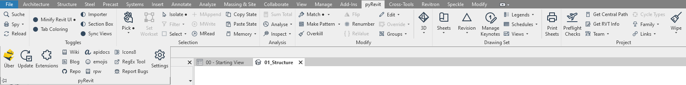
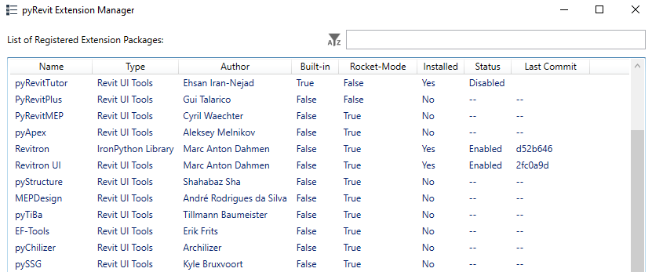
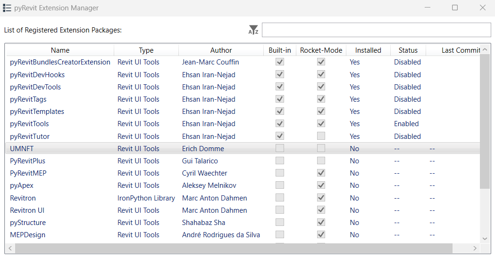
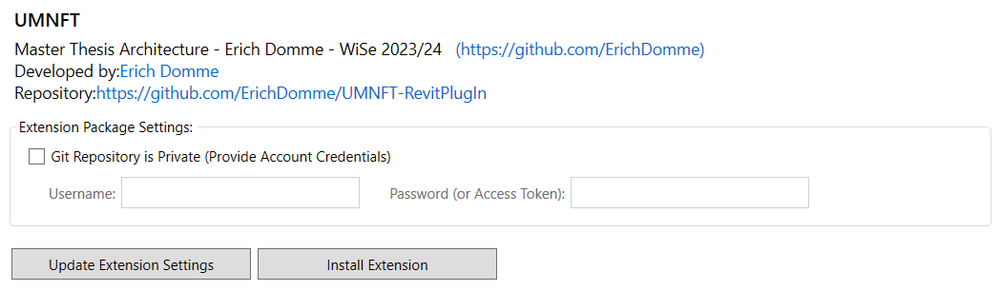
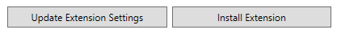

<h1 align="center">
  <a name="logo"></a>
  <br>
  Urban Mining NFT <br>
  - UMNFT - <br>
  PART 01 <br>
  Revit-Plugin
</h1>

<div align="center"></div>

<p align="center"><font size="3">
This project was developed during my Master Thesis<br>
at RWTH Aachen University, winter semester 2023/24, Faculty of Architecture<br>
First examiner:<br>
Univ.-Prof. Dr. Jakob Beetz, Design Computation | CAAD<br>
Second examiner:<br>
Jun.Prof. Dr.-Ing. Linda Hildebrand, Cycle-Oriented Construction<br>
This Plugin is part 1 of 3. </p>

## Excerpt from the Master's thesis
### 3.1 Revit-Plugin 
In the initial phase of this master's thesis, a customized plugin for Autodesk Revit was developed using pyRevit. This resulted in the creation of an innovative tool called UMNFT, an acronym for Urban Mining Non-Fungible Token, which was seamlessly integrated into Revit. At the heart of this tool is a set of Python scripts precisely tailored to the specific needs of this study. The main functionalities of the plugin are realized by three central scripts: "EXPORT IFC", "UPLOAD TO IPFS" and "ALL IN ONE". Each script fulfills a specific role in the process of generating and administering urban mining NFTs. In particular, the "ALL IN ONE" script is the centerpiece, merging the processes of the other two scripts into an efficient workflow. This script accomplishes the complete export of the Revit project as an IFC 4x3 file to the local computer, followed by an automated upload to the InterPlanetary File System using the Pinata API. After successful placement of the file on IPFS, a unique hash code is provided to the user, which serves as a specific reference point for the uploaded file in IPFS and plays an essential role in the UMNFT process. The following subchapters provide an insight into the "ALL IN ONE" Python script and explain its functions.

<div align="center">

</div>

This integration with Revit enables intuitive and user-friendly interaction with blockchain technologies, greatly simplifying the accessibility and application of urban mining NFTs in the construction industry. The entire plugin is available on GitHub, with installation instructions documented in detail in the accompanying README.

#### 3.1.1 Imports and .NET references
- **clr imports and .NET references:**<br>
The script imports .NET libraries to access Revit APIs and other necessary functions.
#### 3.1.2 Functions of the script
- **IFC export (export_to_ifc)**<br>
Exports a Revit document as an IFC file. The function takes a Revit document (doc), an export folder (export_folder) and a file name (filename) as input and carries out the export.
- **User input for file names (get_filename_from_user)**<br>
Allows the user to enter a filename for the IFC file. Ensures that no file name is used twice and requests a new entry if necessary.
- **Upload the file to IPFS (pin_file_to_ipfs)**<br>
Uploads the exported IFC file to IPFS. Uses the Pinata API to upload the file. If successful, it returns the response containing the IPFS hash of the file.
- **Error handling**<br>
Catches WebException errors and returns the error message.
- **User query for local file retention (user_wants_local_copy)**<br>
Asks the user whether the local IFC file should be kept after uploading. Uses a dialog box to obtain the user's decision.
The script provides a comprehensive solution to integrate Revit and IPFS by allowing users to export IFC files directly from Revit and upload them to IPFS. A user-friendly interface is provided through dialog boxes and user interactions. The script takes care of both the export process and the handling of the upload, including error handling and user decisions regarding local file storage.


## Requirements
> It is assumed that you have Autodesk Revit installed on your computer!<br>
> Revit 2023 has been used for development!<br>
> Except for pyRevit, the other requirements are not mandatory! But they might be, as I will be looking at the extensions in the future!<br>

__Revit Requirements__
1. [__pyRevit__](https://github.com/eirannejad/pyRevit/releases/tag/v4.8.12.22247%2B0031)
2. [RevitPythonShell](https://github.com/architecture-building-systems/revitpythonshell)
3. [RevitLookup](https://github.com/jeremytammik/RevitLookup)
4. [Revitron](https://github.com/revitron/revitron)
5. [Revitron-UI](https://github.com/revitron/revitron-ui)
6. [Speckle](https://speckle.systems/)

## Installation
In order for UMNFT to run on your computer, you will need to do a few installations beforehand. UMNFT is based on pyRevit and this is where we start.
1. Make sure you have Autodesk Revit installed on your computer!
2. Install the latest [pyRevit version](https://github.com/eirannejad/pyRevit/releases), during the development of UMNFT the version [v4.8.13.23182](https://github.com/eirannejad/pyRevit/releases/tag/v4.8.13.23182%2B2215) was used. The installation is self-explanatory and very well documented, but a look at the [Notion Page](https://pyrevitlabs.notion.site/pyrevitlabs/pyRevit-bd907d6292ed4ce997c46e84b6ef67a0) is worthwhile.
3. After the successful installation of pyRevit, Navigate now to the extensions of pyRevit, under the first tab. 
<div align="center">

</div>

4. You should now see a list of all extensions that are either written by pyRevit itself or recommended by pyRevit, this is the __pyRevit Extension Manager__. We now want to add "UMNFT" to this list!
> __"UMNFT" should not be visible to you yet, as shown in the screenshot below!__<br>

<div align="center">

</div>


5. To do this, we need to find the location of these listed extensions. They are written inside a json file, with the name "extensions.json"! This should be found here:<br>
`C:\Users\cxs-user\AppData\Roaming\pyRevit-Master\extensions\`

6. Add the following code snippet at the end of the json file:
> :warning: **You will need admin rights here!** Be very careful! If in doubt, contact your IT support!
````
        {
            "builtin": "False",
            "default_enabled": "True",
            "type": "extension",
            "rocket_mode_compatible": "False",
            "name": "UMNFT",
            "description": "Master Thesis Architecture - Erich Domme - WiSe 2023/24",
            "author": "Erich Domme",
            "author_profile": "https://github.com/ErichDomme",
            "url": "https://github.com/ErichDomme/UMNFT-RevitPlugIn",
            "website": "https://github.com/ErichDomme",
            "image": "",
            "dependencies": []
        }
````
> __Make sure you place the commas in the right place!__
````
{
    "extensions": [
        {
            n. Extension
        },
        {
            UMNFT
        }
    ]
}
````

7. Depending on your system it may be enough to reload pyRevit __and__ update it once. However, my recommendation would be a __restart__ of Revit. Any changes will be added automatically. 

8. Navigate to the __pyRevit Extension Manager__ again. You should now be able to see "UMNFT"!

<div align="center">

</div>

9. "UMNFT" is currently not a private repository. But that can change, therefore the check box "Git repository is private" has not to be checked! If you want to get the access token, after it is private, contact [me](mailto:erich.domme@rwth-aachen.de)!

<div align="center">

</div>

10. In contrast to me, "UMNFT" will not yet be installed in your Revit. You should do this by clicking on Install Extension.

<div align="center">

</div>

11. Done! You should now have "UMNFT" in Revit!

## Project Status
<span style="color:green">**Version 0.0.1 published!**</span>
<!-- _complete_ / _no longer being worked on_. If you are no longer working on it, provide reasons why.-->

## Acknowledgements
Without these people and their projects, UMNFT would not have been possible:
- [Ehsan Iran-Nejad](https://github.com/eirannejad) with [pyRevit](https://github.com/eirannejad/pyRevit)
- [Erik Frits](https://github.com/ErikFrits) with [EF-Tools](https://github.com/ErikFrits/EF-Tools)
- [Gavin Crump, aussieBIMguru](https://github.com/aussieBIMguru) with [guRoo](https://github.com/aussieBIMguru/guRoo/tree/main/guRoo.tab/Tools.panel)
- [Marc Anton Dahmen](https://github.com/marcantondahmen) with [revitron](https://github.com/revitron/revitron)
- [Jean-Marc Couffin](https://github.com/jmcouffin) with [bimone](https://github.com/bimone/scripts-dynamo)


## Contact
Created by [Erich Domme](mailto:erich.domme@rwth-aachen.de) - feel free to contact me!